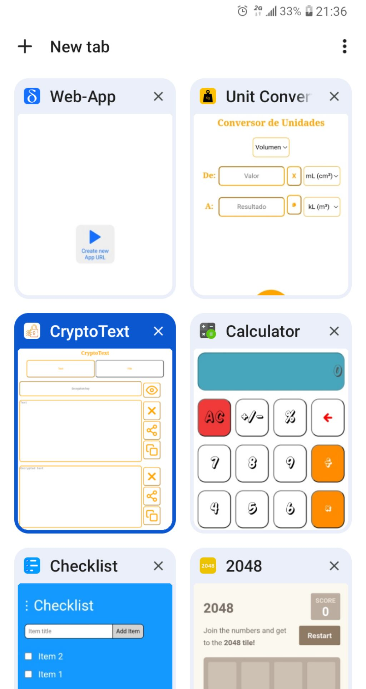

# Web-App

Web-App allows you to open web apps easily in your browser completely offline.

## How to use ?

Clone this project and run it over http localhost and open in the browser.

You can run http localhost using python like this:

`python -m http.server`

Then just go to your browser and write in the adress bar:

`http://localhost:8000`

### Using the app

Once you open the url in the browser the main app should open, you will be able to use it to create new windows (with new generated urls), on each new window you will be able to select a web app which will have to be inside a zip file that you will select from your device files.
Once the selected web app is opened it will be accessible completely offline from that url even when you close the http server.
So you can open as many new windows as you want and select a web app for each one, once you finish opening new windows you can close the http server and all you opened will be accessible for ever from that url and offline.
