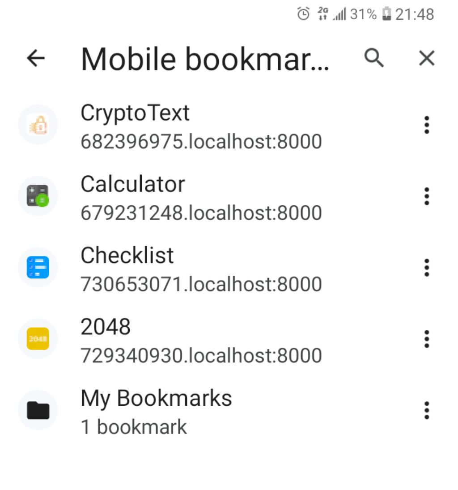
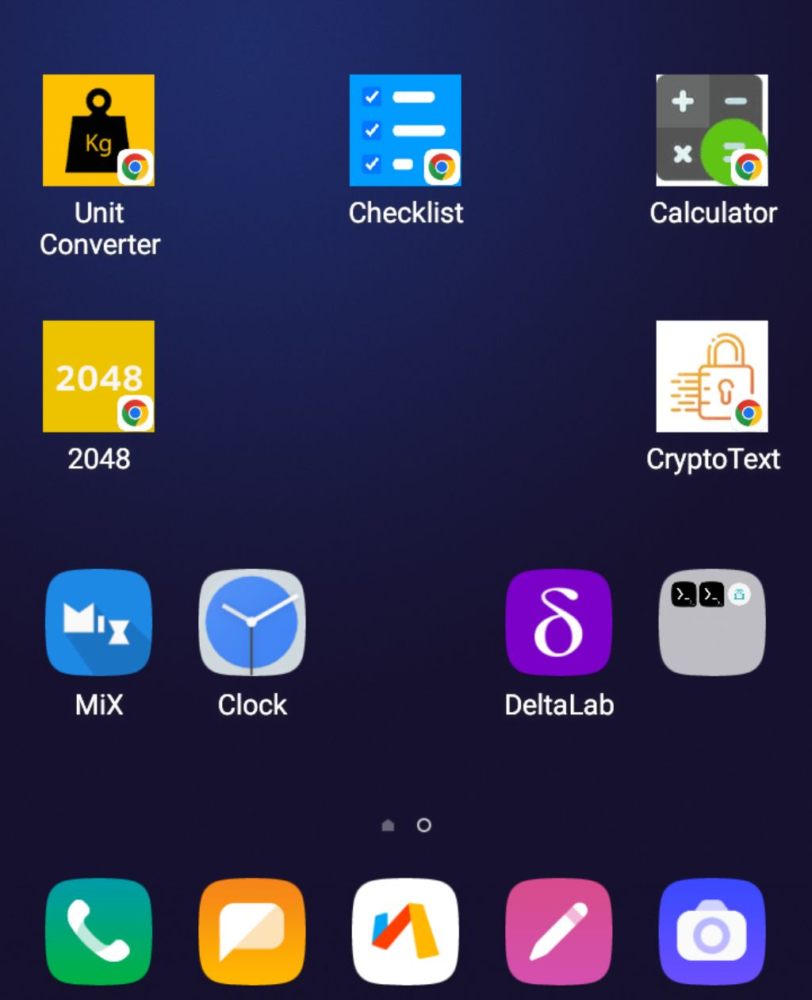

# Web-App
This allows you to open web apps easily in your browser completely offline.

## How to use ?
Just run it over http localhost and open in the browser.

You can run it using python like this:

`python -m http.server`

Then just go to your browser and write in the adress bar:

`http://localhost:8000`

It is also allowed to use the url like this:

`http://web-app.localhost:8000`

Also you can put anything before "web-app" in case you need it for some reason.

### Using the app
Once you open the url in the browser the main app should open, you will be able to use it to create new windows (with new random urls), on each new window you will be able to select a .zip file (or .xdc in case of WebXDCs) from your device files, the zip must contain the web app content you want to open for this window/url.
Once the selected web app is opened it will be accessible completely offline.
So you can open as many new windows as you want and select a web app for each one, once you finish opening new windows you can close the http server.

## Notes

This allows you to run [webXDCs](https://webxdc.org/) too!

Every app can have an icon (just need to have an img in the root directory named "icon." + ext) and also a name that can be set as the index.html title or in webxdc case in the app manifest.

This will be useful to recognize easily every app in the browser since there will be a random url for every app and also to recognize apps shorcuts on the home screen (on browsers and OS that supports it), as you can see in the screenshots below.

This app requires [serviceWorkers](https://developer.mozilla.org/en/docs/Web/API/Service_Worker_API) to work in your navigator where you open the apps.

